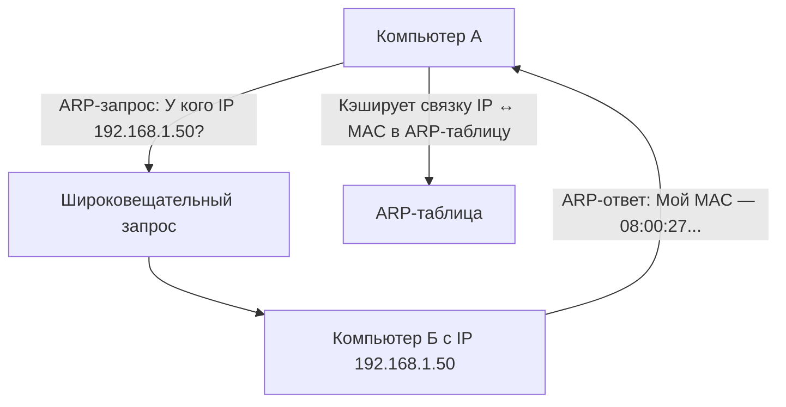

#term/concept #must-know #tech

# 🔗 ARP (Address Resolution Protocol)

> [!abstract] Суть одной фразой
> ARP — это протокол, который связывает IP-адрес устройства с его физическим MAC-адресом в локальной сети. Для специалиста по ИБ ARP — это не только основа работы Ethernet, но и классический вектор атак: ARP-spoofing позволяет перехватывать трафик между устройствами в одной подсети.

---

## 📌 Как работает ARP

1. Компьютер А хочет отправить данные на IP `192.168.1.50`, но не знает MAC-адрес получателя.
2. Он отправляет широковещательный ARP-запрос: «У кого IP 192.168.1.50? Назови свой MAC!».
3. Компьютер Б с этим IP отвечает: «Это я, мой MAC — `08:00:27:ab:cd:ef`».
4. Компьютер А сохраняет эту связку (IP ↔ MAC) в свою ARP-таблицу и отправляет данные.

ARP-таблица — это кэш, который можно посмотреть командой:

> ip neigh show

---

## 🔑 Чем опасен ARP-spoofing

Злоумышленник отправляет поддельные ARP-ответы, убеждая компьютеры в сети, что его MAC-адрес — это адрес шлюза. После этого весь трафик жертвы идёт через злоумышленника (Man-in-the-Middle).

**Последствия:**
- Перехват незашифрованного трафика (HTTP, FTP).
- Перенаправление на фишинговые сайты.
- Отказ в обслуживании (обрыв связи).

**Защита:**
- Статические ARP-записи для критичных устройств (шлюз).
- VLAN-ы для сегментации сети.
- Использование шифрования на верхних уровнях ([[TLS]], [[VPN]]).

---

## 🔧 Как посмотреть ARP-таблицу

> ip neigh show          # современная команда
> arp -a                 # устаревшая, но ещё встречается

---

## 🔗 Связи

- [[MAC-адрес]] — то, что ARP связывает с IP.
- [[IP-адрес]] — то, с чем ARP связывает MAC.
- [[Модель OSI]] — ARP работает на стыке канального (L2) и сетевого (L3) уровней.
- [[tcpdump]] — захват ARP-пакетов для обнаружения спуфинга.

## 💬 Ответ на собеседовании (кратко)

> «ARP связывает IP-адреса с MAC-адресами в локальной сети. Я знаю про атаку ARP-spoofing и могу обнаружить её, сравнивая MAC-адрес шлюза в ARP-таблице с реальным. ARP-таблицу смотрю через `ip neigh show`».

## ❓ Самопроверка

1. **Что делает ARP?** 👉 Связывает IP с MAC в пределах локальной сети.
2. **Что такое ARP-spoofing?** 👉 Подмена MAC-адреса шлюза для перехвата трафика.
3. **Как посмотреть ARP-таблицу?** 👉 `ip neigh show`