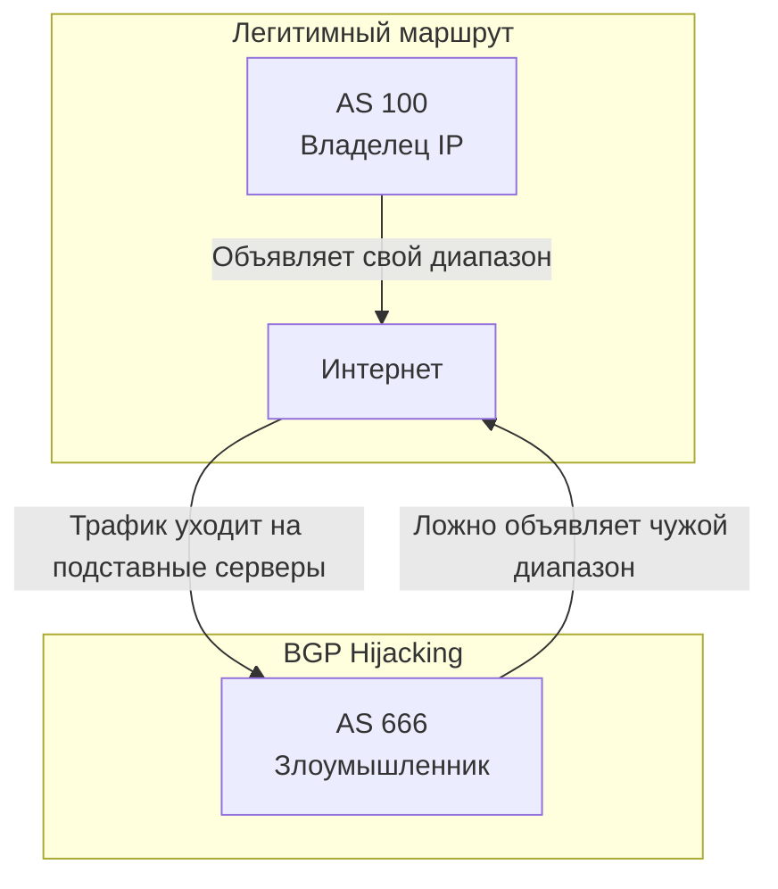

#term/concept #must-know #tech

# 🧭 BGP (Border Gateway Protocol)

> [!abstract] Суть одной фразой
> BGP — это протокол маршрутизации, который связывает автономные системы (AS) в глобальный интернет. Он определяет, через какие цепочки провайдеров пройдёт трафик от отправителя к получателю. Для специалиста по ИБ BGP важен, потому что ошибки или атаки на этот протокол могут увести трафик целых стран в «чёрную дыру» или на подставные серверы.

---

## 📌 Как работает BGP (аналогия)

Представь, что интернет — это множество островов (автономных систем). BGP — это почтовые голуби, которые сообщают каждому острову, через каких соседей можно добраться до других островов.

- **Автономная система (AS)** — сеть под единым административным управлением (провайдер, дата-центр, крупная компания).
- **BGP-маршрутизаторы** обмениваются информацией о доступных маршрутах.
- **Выбор маршрута** основан на политиках (какой путь короче, дешевле, довереннее), а не только на технических метриках.

---

## 🕵️ Главная угроза — BGP Hijacking

Злоумышленник (или недобросовестный провайдер) объявляет, что некий IP-диапазон (например, банка или госоргана) теперь находится в его AS. Маршрутизаторы по всему миру верят этому и направляют трафик на подставные серверы.

**Последствия:**
- Перехват трафика (пассивный или активный MITM).
- Перенаправление на фишинговые сайты.
- Цензура или блокировка ресурсов.

**Реальные инциденты:**
- 2018 год: трафик Google, Facebook, Apple был уведён через Россию и Китай из-за ошибочного BGP-объявления.
- 2008 год: Пакистанский провайдер случайно заблокировал YouTube по всему миру.

---

## 🛡️ Защита — RPKI (Resource Public Key Infrastructure)

RPKI — это система криптографической проверки BGP-объявлений. Владелец IP-диапазона подписывает специальный сертификат, и маршрутизаторы могут проверить, действительно ли этот AS имеет право анонсировать данный диапазон. RPKI значительно снижает риск hijacking, но внедрён пока не повсеместно.

---

## 🔗 Связи

- [[IP-адрес]] — BGP маршрутизирует диапазоны IP.
- [[DNS]] — BGP hijacking может подменять DNS-серверы.
- [[TLS]] — шифрование защищает содержимое трафика, даже если он уведён, но метаданные (кто с кем общается) видны.
- [[Модель OSI]] — BGP работает на прикладном уровне (L7) поверх TCP (порт 179).

## 💬 Ответ на собеседовании (кратко)

> «BGP — протокол маршрутизации между автономными системами. Его главная уязвимость — BGP hijacking, когда злоумышленник объявляет чужой IP-диапазон. Защита — RPKI, криптографическая проверка владельца диапазона».

## ❓ Самопроверка

1. **Что такое автономная система (AS)?** 👉 Сеть под единым управлением (провайдер, дата-центр).
2. **Как работает BGP hijacking?** 👉 Злоумышленник объявляет чужой IP-диапазон, и трафик уходит на его серверы.
3. **Что такое RPKI?** 👉 Система криптографической проверки BGP-объявлений.