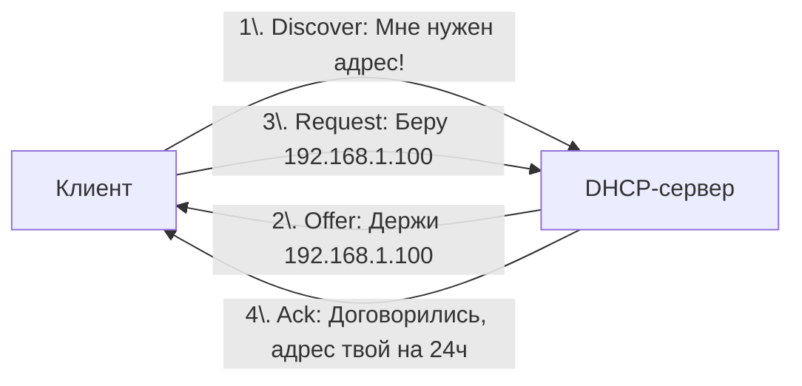

#term/concept #must-know #tech

# 🏨 DHCP (Dynamic Host Configuration Protocol)

> [!abstract] Суть одной фразой
> DHCP — это протокол, который автоматически выдаёт устройствам IP-адреса и другие сетевые настройки при подключении к сети. Без DHCP тебе пришлось бы вручную прописывать IP, маску, шлюз и DNS на каждом устройстве. Для специалиста по ИБ DHCP — это не только удобство, но и потенциальный вектор атак (DHCP-spoofing, rogue DHCP-сервер).

---

## 📌 Как работает DHCP (упрощённо)

Представь, что ты заселяешься в отель. Вместо того чтобы искать свободный номер самой, ты идёшь на стойку регистрации (DHCP-сервер) и получаешь ключ от номера (IP-адрес) на время проживания (lease time).

Технически это происходит в четыре шага (DORA):

1. **Discover:** клиент кричит в сеть: «Есть тут DHCP-сервер? Мне нужен адрес!».
2. **Offer:** сервер отвечает: «Держи адрес `192.168.1.100`, он свободен».
3. **Request:** клиент подтверждает: «Хорошо, беру `192.168.1.100`».
4. **Ack:** сервер фиксирует выдачу: «Договорились, адрес твой на 24 часа».

---

## 🔑 Что выдаёт DHCP (кроме IP)

- **Маску подсети** (`255.255.255.0`).
- **Шлюз по умолчанию** (`192.168.1.1`) — куда слать трафик во внешний мир.
- **DNS-серверы** (`8.8.8.8`) — кто будет разрешать доменные имена.
- **Время аренды (lease time)** — на какой срок выдан адрес.

---

## 🕵️ Значимость для ИБ

- **Rogue DHCP-сервер:** злоумышленник запускает свой DHCP-сервер и выдаёт жертвам подставные настройки (например, свой шлюз и DNS), перехватывая трафик.
- **DHCP starvation:** злоумышленник исчерпывает пул адресов, запрашивая тысячи адресов на подставные MAC, и легитимные клиенты не могут подключиться (DoS).
- **DHCP snooping (защита):** на управляемых коммутаторах можно настроить фильтрацию DHCP-трафика, чтобы блокировать ответы от неавторизованных серверов.

---

## 🔧 Как посмотреть выданный адрес

> ip a                          # посмотреть текущий IP (помечен как dynamic)
> cat /var/lib/dhcp/dhclient.leases  # история аренды (на клиенте)

---

## 🔗 Связи

- [[IP-адрес]] — то, что выдаёт DHCP.
- [[DNS]] — адреса DNS-серверов, которые тоже выдаёт DHCP.
- [[MAC-адрес]] — DHCP-сервер привязывает выданный IP к MAC-адресу клиента.
- [[Модель OSI]] — DHCP работает на прикладном уровне (L7), поверх UDP (порты 67 и 68).

## 💬 Ответ на собеседовании (кратко)

> «DHCP автоматически выдаёт IP-адреса и сетевые настройки. Я знаю четыре шага DORA: Discover, Offer, Request, Ack. Понимаю угрозы rogue DHCP-сервера и starvation-атак. Для защиты используется DHCP snooping на коммутаторах».

## ❓ Самопроверка

1. **Что такое DORA?** 👉 Discover, Offer, Request, Ack — четыре шага получения адреса по DHCP.
2. **Какой порт использует DHCP-сервер?** 👉 UDP 67 (сервер) и UDP 68 (клиент).
3. **Что такое rogue DHCP-сервер?** 👉 Подставной сервер, выдающий жертвам ложные сетевые настройки для перехвата трафика.