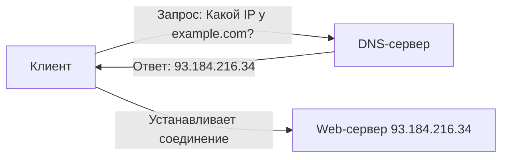

#term/concept #must-know #tech

# 🌍 DNS (Domain Name System)

> [!abstract] Суть одной фразой
> DNS — это система доменных имён, которая переводит понятные человеку адреса (`google.com`) в IP-адреса (`142.250.185.46`), понятные компьютерам. Для специалиста по ИБ DNS — это не просто «телефонная книга интернета», а вектор атак, инструмент обхода блокировок и ценный источник улик при расследовании.

---

## 📌 Как работает DNS (упрощённо)

1. Ты вводишь в браузере `example.com`.
2. Компьютер спрашивает DNS-сервер: «Какой IP у `example.com`?».
3. DNS-сервер отвечает: `93.184.216.34`.
4. Браузер устанавливает соединение с этим IP.

Это работает рекурсивно: если DNS-сервер не знает ответа, он спрашивает вышестоящие серверы, вплоть до корневых.

---

## 🔑 Ключевые типы DNS-записей

| Тип | Что хранит | Пример |
|---|---|---|
| **A** | IPv4-адрес домена | `example.com → 93.184.216.34` |
| **AAAA** | IPv6-адрес домена | `example.com → 2606:2800:220:1:248:1893:25c8:1946` |
| **CNAME** | Каноническое имя (алиас) | `www.example.com → example.com` |
| **MX** | Почтовый сервер домена | `example.com → mail.example.com` |
| **NS** | DNS-сервер, обслуживающий домен | `example.com → ns1.example.com` |
| **PTR** | Обратная запись (IP → домен) | `93.184.216.34 → example.com` |

---

## 🕵️ Значимость для ИБ

- **DNS-spoofing / cache poisoning:** злоумышленник подменяет ответ DNS-сервера, направляя жертву на подставной сайт.
- **DNS-туннелирование:** скрытая передача данных через DNS-запросы (обход файрволов и DLP-систем).
- **DNS over HTTPS (DoH):** шифрует DNS-запросы, что хорошо для приватности, но усложняет мониторинг на уровне корпоративной сети.
- **Расследование:** по DNS-запросам можно восстановить, с какими доменами общалась скомпрометированная машина.

## 🔧 Инструменты

- `dig` — детальный DNS-запрос (показывает все записи, серверы, время ответа).
- `nslookup` — более простая утилита для DNS-запросов.
- `host` — быстрая проверка DNS.

> dig example.com A        # запросить A-запись
> dig -x 93.184.216.34     # обратный поиск (PTR)

## 🔗 Связи

- [[IP-адрес]] — то, во что DNS превращает домены.
- [[Протокол (сетевой)]] — DNS работает поверх UDP (порт 53), иногда TCP.
- [[tcpdump]] — захват DNS-трафика для анализа.
- [[Модель OSI]] — DNS работает на прикладном уровне (L7).

## 💬 Ответ на собеседовании (кратко)

> «DNS — это система доменных имён, которая переводит домены в IP-адреса. Я знаю основные типы записей (A, AAAA, CNAME, MX, PTR). Понимаю угрозы: DNS-spoofing, cache poisoning, DNS-туннелирование. Для диагностики использую `dig`».

## ❓ Самопроверка

1. **Что делает A-запись?** 👉 Связывает домен с IPv4-адресом.
2. **Какой порт использует DNS?** 👉 53 (UDP и TCP).
3. **Что такое DNS-spoofing?** 👉 Подмена ответа DNS-сервера для перенаправления жертвы на фишинговый сайт.