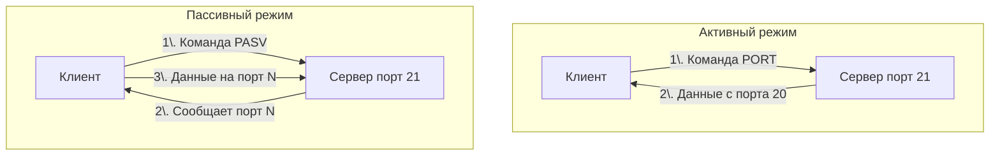

#term/concept #must-know #tech

# 📁 FTP (File Transfer Protocol)

> [!abstract] Суть одной фразой
> FTP — это стандартный сетевой протокол для передачи файлов между клиентом и сервером. Он не использует шифрование, передавая логины, пароли и данные в открытом виде. Для специалиста по ИБ FTP — это классический пример того, как **не** надо делать: любой, кто перехватит трафик, увидит всё содержимое сессии.

---

## 📌 Как работает FTP

FTP использует архитектуру «клиент-сервер» и для работы требует **два соединения**:

1.  **Управляющее соединение (Control Connection):** по умолчанию работает на порту **21/TCP**. Через него клиент отправляет команды (`USER`, `PASS`, `LIST`, `RETR`) и получает ответы сервера.
2.  **Соединение для передачи данных (Data Connection):** открывается динамически для каждой передачи файла или списка директорий. Именно поэтому FTP так не любит файрволы — предсказать порт для данных сложно.

---

## 🔑 Активный и пассивный режимы

Из-за двух соединений FTP исторически имеет два режима работы. Проблема всегда в том, **кто к кому подключается** за данными.

- **Активный режим (Active mode):** сервер **сам подключается** к клиенту для передачи данных. Это плохо работает, если клиент находится за NAT или файрволом.
- **Пассивный режим (Passive mode):** клиент подключается к серверу и для команд, и для данных. Сервер сообщает клиенту, на каком порту ожидать передачу. Этот режим используется по умолчанию в современных клиентах и лучше совместим с файрволами.

---

## ⚔️ Почему FTP — это небезопасно

FTP был разработан в 1971 году, когда интернет был маленькой доверенной сетью. Сегодня у него три критические проблемы:

- **Отсутствие шифрования:** логины и пароли передаются в открытом виде, как и сами файлы.
- **Атака FTP Bounce:** злоумышленник может заставить FTP-сервер сканировать внутреннюю сеть, подставляя разные IP-адреса.
- **Анонимный доступ:** по умолчанию многие серверы разрешали вход под пользователем `anonymous` с любым паролем, что открывало доступ к файлам всем желающим.

> [!danger] FTP в корпоративной сети
> Обнаружение открытого 21-го порта на периметре — критичная находка. Современные стандарты безопасности (PCI DSS, ISO 27001) прямо запрещают использование FTP для передачи конфиденциальных данных.

### 🛡️ Безопасные альтернативы

- **SFTP (SSH File Transfer Protocol):** работает поверх [[SSH]] на порту 22, шифрует всё, использует единое соединение.
- **FTPS (FTP over TLS):** добавляет [[TLS]]-шифрование к классическому FTP. Сложнее в настройке из-за двух соединений и сертификатов.
- **[[SCP]]:** простая утилита для копирования файлов поверх SSH.

---

## 🔗 Связи

- [[SSH]], [[TLS]] — безопасные альтернативы для шифрования канала.
- [[Протоколы транспортного уровня TCP и UDP]] — FTP работает поверх TCP.
- [[Порт (сетевой)]] — стандартные порты 21 (управление) и 20 (данные).
- [[tcpdump]] — захват FTP-трафика для демонстрации его незащищённости.
- [[Межсетевой экран (Firewall)]] — сложности фильтрации FTP-трафика.

---

## 🧠 Значимость для меня как специалиста по ИБ

- Я знаю, что FTP не шифрует трафик, и могу определить его использование в сети как инцидент.
- Я понимаю разницу между активным и пассивным режимами и почему пассивный режим проще для файрволов.
- Я всегда рекомендую замену FTP на SFTP или FTPS при аудите.

---

## 💬 Ответ на собеседовании (кратко)

> «FTP — протокол передачи файлов без шифрования. Использует два соединения: управляющее на 21/TCP и отдельное для данных. Абсолютно небезопасен для современных сетей. Я всегда рекомендую замену на SFTP (поверх SSH) или FTPS (FTP + TLS)».

---

## ❓ Самопроверка

1.  **Сколько соединений использует FTP?**
    👉 Два: управляющее (порт 21) и для передачи данных (динамический).
2.  **Чем опасен FTP?**
    👉 Передаёт логины, пароли и файлы в открытом виде.
3.  **На какой протокол мигрировать с FTP?**
    👉 SFTP (поверх SSH) или FTPS (FTP + TLS).
## 🛠️ Что нужно для подключения?

Для успешного соединения с сервером требуются четыре параметра:
1. `Хост` (IP-адрес или доменное имя, например: `://mywebsite.com`)
2. `Логин` (Имя пользователя)
3. `Пароль`
4. `Порт` (По умолчанию `21` для FTP, `22` для SFTP)

### Популярные FTP-клиенты (ПО)
- [ ] [[FileZilla]] — самый популярный кроссплатформенный клиент.
- [ ] [[WinSCP]] — отличный инструмент для Windows.
- [ ] [[Cyberduck]] — удобный клиент для macOS и Windows.