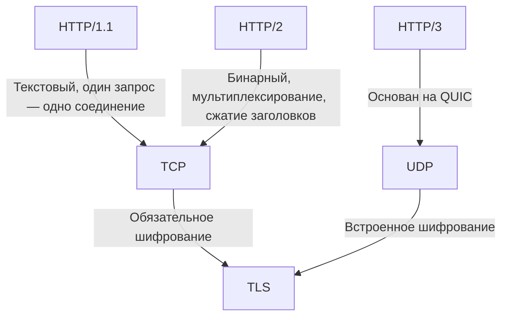

#term/concept #must-know #tech

# 🌐 HTTP, HTTPS, HTTP/2, HTTP/3

> [!abstract] Суть одной фразой
> HTTP (HyperText Transfer Protocol)  — это протокол передачи гипертекста, основа Всемирной паутины. HTTPS — это тот же HTTP, но поверх [[TLS]], с шифрованием и проверкой подлинности сервера. HTTP/2 и HTTP/3 — современные версии, которые ускоряют загрузку страниц и улучшают безопасность.

Для специалиста по ИБ понимание HTTP критично: большинство атак на веб-приложения (XSS, SQLi, CSRF) работают именно на этом уровне, а анализ логов веб-сервера — повседневная задача при расследовании инцидентов.

---

## 📌 HTTP — основа веба

HTTP (HyperText Transfer Protocol) работает по модели «клиент-сервер»:

1. Клиент (браузер) отправляет **запрос** (request).
2. Сервер обрабатывает его и возвращает **ответ** (response).
3. Соединение закрывается (в HTTP/1.0) или переиспользуется (в HTTP/1.1+).

### 🔑 Методы HTTP

| Метод | Назначение | Пример |
|---|---|---|
| **GET** | Получить данные (страницу, картинку) | `GET /index.html` |
| **POST** | Отправить данные (форму, JSON) | `POST /login` |
| **PUT** | Заменить ресурс целиком | `PUT /user/1` |
| **DELETE** | Удалить ресурс | `DELETE /user/1` |
| **HEAD** | Только заголовки (без тела) | Проверка существования ресурса |

### 🔑 Коды ответа (Status Codes)

- **2xx** — успех: `200 OK`, `201 Created`.
- **3xx** — перенаправление: `301 Moved Permanently`, `302 Found`.
- **4xx** — ошибка клиента: `400 Bad Request`, `403 Forbidden`, `404 Not Found`.
- **5xx** — ошибка сервера: `500 Internal Server Error`, `502 Bad Gateway`, `503 Service Unavailable`.

---

## 🔒 HTTPS — HTTP + TLS

HTTPS (HTTP Secure) оборачивает HTTP-трафик в шифрованный канал [[TLS]]. Это даёт:

- **[[Конфиденциальность]]:** трафик зашифрован, его нельзя прочитать.
- **[[Целостность]]:** данные нельзя незаметно изменить.
- **[[Аутентификация]]:** сервер предъявляет [[Сертификат открытого ключа|сертификат]], подтверждающий, что он тот, за кого себя выдаёт.

Использует порт `443` (HTTP — `80`).

---

## 🚀 HTTP/2 и HTTP/3 — ускорение и безопасность

| Версия | Ключевые отличия | Транспорт |
|---|---|---|
| **HTTP/1.1** | Текстовый, одно соединение — один запрос (или пайплайнинг) | TCP |
| **HTTP/2** | Бинарный, мультиплексирование (много запросов в одном TCP-соединении), сжатие заголовков | TCP + [[TLS]] (обязателен в браузерах) |
| **HTTP/3** | Основан на QUIC (UDP), а не на TCP. Быстрее, нет блокировки очереди (head-of-line blocking) | UDP + QUIC + встроенный TLS 1.3 |

> [!note] Важно для ИБ
> HTTP/2 и HTTP/3 сложнее анализировать, потому что трафик бинарный и зашифрован. Требуются инструменты, умеющие декодировать эти протоколы (Wireshark, tcpdump с поддержкой QUIC).

---

### Все протоколы активно используются прямо сейчас, причем в интернете сложилось устойчивое трехпротокольное равновесие. 

Наряду с ними стремительно растет доля новейшего HTTP/3. 
Статистика распределения глобального трафика выглядит следующим образом: 
- HTTP/2 удерживает лидерство и обслуживает около 51% всех сетевых запросов.
- HTTP/1.1 прочно занимает второе место с долей порядка 27-28%.
- HTTP/3 замыкает тройку и забирает на себя около 21% трафика.

Каждый протокол решает свои задачи, поэтому они не заменяют друг друга полностью.

### Где и почему до сих пор используется HTTP/1.1?
Несмотря на солидный возраст (создан в 1997 году), этот протокол незаменим во многих сферах:
- Внутренние микросервисы (Backend-to-Backend): внутри закрытых серверных сетей (дата-центров) задержки минимальны, а файлы передаются крупные. В таких условиях простая текстовая структура HTTP/1.1 работает быстрее и тратит меньше процессорной памяти на шифрование и упаковку.
- Корпоративные сети и прокси: во многих крупных компаниях и банках установлены старые брандмауэры и прокси-серверы, которые не умеют читать или корректно пропускать бинарные потоки HTTP/2.
- Утилиты и API-клиенты: огромное количество старых скриптов, IoT-устройств (умный дом) и библиотек (например, для парсинга данных) по умолчанию шлют запросы через HTTP/1.1.

### Зачем нужен HTTP/2?
HTTP/2 — это текущий базовый стандарт для обычных веб-сайтов. Его главное преимущество — мультиплексирование. По одному соединению браузер может одновременно скачивать сотни картинок, шрифтов и скриптов. Он используется везде, где важна скорость загрузки интерфейса для живого пользователя.

### Зачем нужен HTTP/3?
HTTP/3 разработан для того, чтобы решить фундаментальные проблемы старого интернета и сделать загрузку сайтов и приложений максимально быстрой и стабильной, особенно на мобильных устройствах.
HTTP/3 используется везде, где критически важна максимальная скорость загрузки, моментальный отклик и стабильная связь в движении
Основные сферы применения HTTP/3:
1. Глобальные IT-гиганты и экосистемыКрупнейшие корпорации первыми внедрили этот протокол для своих сервисов, чтобы разгрузить сети и ускорить доставку контента:
- Google: все поисковые запросы, почта Gmail, карты, нейросеть Gemini, а также YouTube (где это снизило частоту буферизации видео). 
- Meta (Facebook, Instagram, WhatsApp): протокол помогает миллиардам пользователей быстрее загружать тяжелую ленту с фото и короткими видео.
- Социальные платформы и медиахолдинги: например, Pinterest, а также крупнейшие стриминговые и развлекательные платформы планеты.
2. Сервисы доставки контента (CDN) и облака
   Если обычный сайт хочет включить поддержку HTTP/3, ему не обязательно переписывать свой код. Достаточно подключить облачного провайдера.
   - Cloudflare: один из главных популяризаторов HTTP/3, автоматически включающий его для миллионов сайтов, использующих их проксирование.
   - Fastly и Akamai: обеспечивают работу HTTP/3 на инфраструктурном уровне для крупнейших интернет-магазинов (например, Temu) и новостных СМИ.
3. Мобильные приложения и стриминг
   Для смартфонов HTTP/3 — идеальное решение из-за нестабильности беспроводных сетей:
   - Онлайн-кинотеатры и музыкальные сервисы: стриминг аудио и видео высокого разрешения происходит без задержек даже при слабом сигнале.
   - Такси и доставка: приложения (вроде Uber), где водителю и пассажиру критически важно видеть перемещения друг друга на карте без потерь пакетов данных.
4. Онлайн-игры и метаверсы
   Многие современные мультиплеерные мобильные игры используют HTTP/3 (QUIC) для загрузки игровых ресурсов (текстур, моделей) прямо во время матча. Это минимизирует «микрофризы» интерфейса, если у игрока на секунду просел мобильный интернет
### Как они уживаются на одном сайте?
Вам не нужно выбирать какой-то один протокол для своего сайта. Современные веб-серверы (Nginx, Apache) и CDN-сервисы (например, Cloudflare) используют механизм согласования (ALPN).Процесс устроен автоматически:
Если к сайту подключается современный браузер, сервер отдает ему данные по HTTP/3 или HTTP/2.
Если пришел старый бот поисковой системы или корпоративный прокси-сервер, сервер мгновенно и незаметно переключается на HTTP/1.1.

## 🕵️ Значимость для ИБ

- Я анализирую логи веб-сервера (access.log, error.log) для выявления атак (подбор паролей, сканирование уязвимостей).
- Я понимаю, что отсутствие HTTPS — критическая уязвимость, и требую обязательного использования TLS.
- Я знаю, что HTTP/2 и HTTP/3 усложняют перехват трафика, но не делают его невозможным — нужны корпоративные прокси с поддержкой этих протоколов.

## 🔗 Связи

- [[TLS]] — шифрование для HTTPS.
- [[Сертификат открытого ключа]] — аутентификация сервера.
- [[Протокол]] — TCP и UDP как транспорт.
- [[DNS (Domain Name System)]]] — разрешение домена перед HTTP-запросом.

## 💬 Ответ на собеседовании (кратко)

> «HTTP — протокол передачи гипертекста. HTTPS добавляет TLS для шифрования и аутентификации. HTTP/2 вводит мультиплексирование и сжатие, HTTP/3 переходит на QUIC (UDP). Я анализирую HTTP-логи для поиска атак и настаиваю на HTTPS везде, где это возможно».

## ❓ Самопроверка

1. **Чем HTTP отличается от HTTPS?** 👉 HTTPS шифрует трафик через TLS и проверяет сертификат сервера.
2. **Какой порт у HTTPS?** 👉 443.
3. **Что даёт HTTP/2?** 👉 Мультиплексирование (много запросов в одном TCP-соединении), сжатие заголовков, бинарный формат.