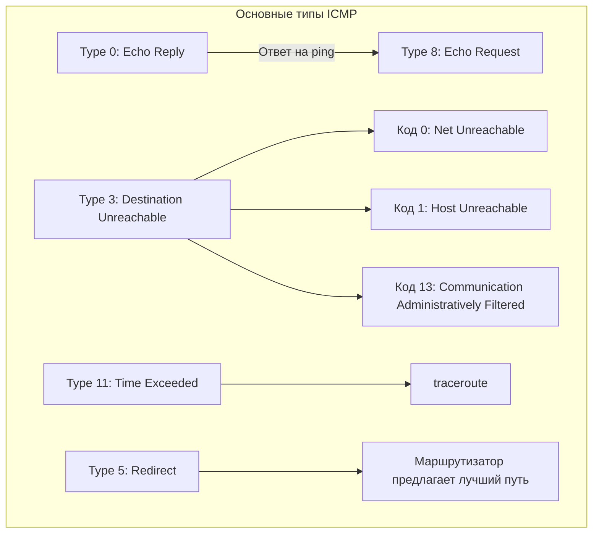

#term/concept #must-know #tech

# 📡 ICMP (Internet Control Message Protocol)

> [!abstract] Суть одной фразой
> ICMP — это служебный протокол сетевого уровня для передачи диагностических сообщений и ошибок. На нём работают ping (Echo Request/Reply) и traceroute (Time Exceeded). Если IP — это почтовая служба, доставляющая письма, то ICMP — это служебные уведомления: «адресат не найден», «письмо слишком большое», «время доставки истекло». 

Для специалиста по ИБ ICMP важен вдвойне: это и инструмент диагностики (`ping`, `traceroute`), и вектор атак (ICMP-туннелирование, Smurf, ICMP-flood).

---

## 📌 Как работает ICMP

ICMP-сообщения инкапсулируются прямо в IP-пакеты (протокол номер 1). У каждого сообщения есть **тип** и **код**, которые уточняют, что именно произошло.

🔑 Основные типы и коды ICMP

| Тип | Название                | Назначение                                                                            | Связанная утилита |
| --- | ----------------------- | ------------------------------------------------------------------------------------- | ----------------- |
| 0   | Echo Reply              | Ответ на запрос ping                                                                  | ping              |
| 3   | Destination Unreachable | Целевой хост или сеть недоступны                                                      |                   |
| 5   | Redirect                | Маршрутизатор сообщает отправителю, что есть более короткий путь                      |                   |
| 8   | Echo Request            | Запрос ping. «Ты жив? Ответь!»                                                        | ping              |
| 11  | Time Exceeded           | Время жизни пакета (TTL) истекло. Используется в traceroute для обнаружения маршрута. | traceroute        |
|     |                         |                                                                                       |                   |

>[!note] ICMP и traceroute
Утилита traceroute отправляет пакеты с последовательно увеличивающимся TTL. Каждый маршрутизатор, через который проходит пакет с истёкшим TTL, отправляет обратно ICMP Time Exceeded. Так traceroute собирает список всех узлов на пути к цели.

### 🕵️ Значимость для специалиста по ИБ

- Диагностика сети: ping — первое, что я запускаю, чтобы проверить доступность хоста. traceroute показывает путь пакетов и помогает найти проблемный узел.

- ICMP Redirect: злоумышленник может отправить поддельное ICMP Redirect и перенаправить трафик жертвы через свой хост. В современных ОС ICMP Redirect часто отключён или требует явного включения.

- ICMP-туннелирование: данные можно спрятать внутри ICMP-пакетов, обходя файрволы, которые не анализируют содержимое ICMP-трафика. Это классический метод эксфильтрации данных.

- Smurf-атака: злоумышленник отправляет ICMP Echo Request на широковещательный адрес, подменив обратный адрес на IP жертвы. Все хосты в сети отвечают жертве, вызывая DDoS. Защита — отключение ответа на широковещательные ICMP.

- ICMP Flood: разновидность DoS, когда жертву заваливают ICMP-запросами, истощая её ресурсы.

### 🔧 Инструменты
ping — проверка доступности хоста.

traceroute (или tracert в Windows) — трассировка маршрута.

tcpdump — захват ICMP-пакетов для анализа (фильтр: icmp).

hping3 — ручная отправка ICMP-пакетов с заданными параметрами.

### 🔗 Связи
[[IP-адрес]] — ICMP работает поверх IP.

[[Протокол]] — общее понятие протокола.

[[ping]], [[traceroute]] — утилиты, основанные на ICMP.

[[Сетевые атаки (каталог)]] — Smurf, ICMP Flood, ICMP Redirect.

[[Модель OSI]] — ICMP работает на сетевом уровне (L3).

### 💬 Ответ на собеседовании (кратко)
- «ICMP — это служебный протокол сетевого уровня для передачи диагностических сообщений и ошибок. На нём работают ping (Echo Request/Reply) и traceroute (Time Exceeded). С точки зрения ИБ опасны ICMP Redirect, Smurf-атака, ICMP-туннелирование и ICMP Flood. При аудите я проверяю, не блокирует ли файрвол лишние типы ICMP, кроме Echo Request/Reply».

### ❓ Самопроверка
- Какой тип ICMP использует ping? 👉 Type 8 (Echo Request) для запроса и Type 0 (Echo Reply) для ответа.
- Что такое Smurf-атака? 👉 Отправка ICMP Echo Request на широковещательный адрес от имени жертвы, чтобы все хосты сети ответили жертве, вызвав DDoS.
- Почему ICMP Redirect опасен? 👉 Злоумышленник может перенаправить трафик жертвы через свой хост для перехвата.