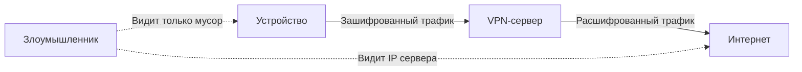

#term/concept #must-know #tech

# 🔒 VPN (Virtual Private Network)

> [!abstract] Суть одной фразой
> VPN — это технология создания защищённого «туннеля» между устройством и сетью через небезопасную среду (интернет). Весь трафик внутри туннеля **шифруется**, и даже если злоумышленник перехватит пакеты, он не сможет прочитать их содержимое. Для специалиста по ИБ VPN — один из главных инструментов защиты данных в движении (data-in-transit).

---

## 📌 Как это работает (простая аналогия)

Представь, что интернет — это оживлённая улица, по которой все ходят и могут заглянуть в твою сумку. VPN прокладывает под этой улицей **закрытую трубу**, по которой твои посылки едут в непрозрачном контейнере. Никто с улицы не знает, что внутри, и даже не видит, кому именно ты отправляешь посылку.

Технически VPN создаёт зашифрованный канал между твоим устройством и VPN-сервером. Твой трафик сначала шифруется, потом уходит в туннель, а на выходе расшифровывается и отправляется дальше в обычный интернет уже с IP-адреса сервера.

---

## 🔑 Ключевые свойства

- **Конфиденциальность:** трафик зашифрован, его нельзя прочитать при перехвате.
- **Целостность:** данные нельзя незаметно изменить по пути.
- **Аутентификация:** обе стороны подтверждают свою подлинность (чтобы ты не подключился к подставному серверу).
- **Туннелирование:** весь трафик идёт через единый защищённый канал.

---

## 🔧 Популярные протоколы и инструменты

- **[[WireGuard]]** — современный, очень быстрый, минималистичный. Встроен в ядро Linux. Использует [[ChaCha20]]-Poly1305 для шифрования и Curve25519 для обмена ключами.
- **OpenVPN** — гибкий и проверенный временем, работает на многих платформах. Может использовать [[AES]] или [[ChaCha20]].
- **IPsec** — часто используется в корпоративных сетях для site-to-site туннелей. Более сложен в настройке.

---

## 🕵️ Сценарии использования в ИБ

- **Защита удалённого доступа:** сотрудники подключаются к офисной сети из дома или командировки.
- **Связывание офисов (site-to-site):** два офиса объединяются в одну защищённую сеть через интернет.
- **Обход блокировок и защита приватности:** шифрование трафика от провайдера или недоверенной сети (публичный Wi-Fi).
- **Сокрытие реального IP:** твой трафик выходит в интернет с IP-адреса VPN-сервера.

> [!note] VPN ≠ анонимность
> VPN скрывает трафик от провайдера, но сам VPN-провайдер видит, куда ты ходишь. Анонимность — это отдельная задача, часто решаемая через Tor.

---

## 🔗 Связи

- [[WireGuard]], [[OpenVPN]], [[IPsec]] — конкретные реализации.
- [[TLS]] — шифрование трафика на прикладном уровне (веб).
- [[Симметричное шифрование]], [[Асимметричное шифрование]] — криптографическая основа.
- [[iptables]] — фильтрация трафика, который идёт через VPN.
- [[Сетевые технологии]] — общая картина.

---

## 🧠 Значимость для меня как специалиста по ИБ

- Я могу развернуть VPN для защиты удалённого доступа и знаю, какой протокол выбрать под задачу.
- Я понимаю, что VPN не делает меня «невидимой», и различаю задачи шифрования, анонимизации и обхода блокировок.
- Я знаю, что такое Perfect Forward Secrecy (PFS) и почему оно критично для VPN.

---

## 💬 Ответ на собеседовании (кратко)

> «VPN — это защищённый зашифрованный туннель через небезопасную сеть. Он обеспечивает конфиденциальность, целостность и аутентификацию трафика. Я работал с WireGuard и OpenVPN, знаю разницу между site-to-site и client-to-site. Понимаю, что VPN — это не анонимность, а инструмент защиты корпоративных коммуникаций».

---

## ❓ Самопроверка

1. **Что такое VPN простыми словами?**  
   👉 Закрытая труба под улицей — твои посылки никто не видит.
2. **Какой VPN-протокол сейчас считается самым современным?**  
   👉 WireGuard.
3. **Гарантирует ли VPN анонимность?**  
   👉 Нет, VPN-провайдер видит твой трафик.