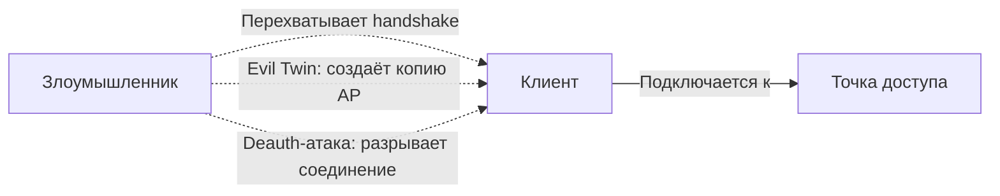

#term/concept #must-know #tech

# 📶 Wi-Fi (беспроводные сети)

> [!abstract] Суть одной фразой
> Wi-Fi — это технология беспроводной передачи данных в локальной сети, основанная на стандартах IEEE 802.11. Для специалиста по ИБ Wi-Fi — это не только удобство, но и один из самых распространённых векторов атак: от подбора пароля к точке доступа до перехвата трафика через подставную сеть.

---

## 📌 Как работает Wi-Fi (упрощённо)

1. **Точка доступа (Access Point, AP)** создаёт беспроводную сеть с определённым именем (SSID).
2. **Клиенты** (ноутбуки, телефоны) подключаются к AP и получают доступ в сеть.
3. Весь обмен данными идёт по радиоканалу, и любой в радиусе действия может «слышать» пакеты.

Именно общая доступность радиосреды делает Wi-Fi уязвимым: злоумышленник может слушать трафик, подсовывать подставные точки доступа и атаковать процесс аутентификации.

---

## 🔑 Стандарты шифрования Wi-Fi

| Стандарт | Год | Стойкость | Статус |
|---|---|---|---|
| **WEP** | 1999 | Полностью взломан | ❌ Запрещён |
| **WPA** | 2003 | Взломан (TKIP) | ❌ Запрещён |
| **WPA2** | 2004 | Стойкий (AES-CCMP) | ✅ Рекомендован |
| **WPA3** | 2018 | Стойкий (AES-GCMP, SAE) | ✅ Современный стандарт |

> [!danger] WEP и WPA
> Сети с WEP и WPA взламываются за минуты. Если ты видишь такую сеть — это инцидент.

---

## 🕵️ Основные атаки на Wi-Fi

- **Deauthentication attack:** злоумышленник отправляет пакеты деаутентификации, заставляя клиента переподключиться, и перехватывает handshake для подбора пароля.
- **PMKID attack:** атака на WPA2/WPA3 без необходимости ждать подключения клиента.
- **Evil twin:** подставная точка доступа с таким же SSID, как у легитимной. Жертва подключается к ней, и весь трафик идёт через злоумышленника.
- **KARMA attack:** точка доступа отвечает на запросы к любым SSID, привлекая клиентов, которые автоматически ищут знакомые сети.

---

## 🔧 Инструменты для тестирования

- **aircrack-ng** — классический набор для аудита Wi-Fi.
- **hcxdumptool / hcxtools** — современный инструмент для захвата handshake и PMKID.
- **Wifite** — автоматизированный инструмент для атак на Wi-Fi.

---

## 🔗 Связи

- [[WPA2]], [[WPA3]] — стандарты шифрования.
- [[AES]], [[TKIP]] — алгоритмы, используемые в Wi-Fi.
- [[MAC-адрес]] — фильтрация по MAC (легко обходится).
- [[VPN]] — защита трафика в недоверенных Wi-Fi-сетях.

## 💬 Ответ на собеседовании (кратко)

> «Wi-Fi использует стандарты WPA2/WPA3. WEP и WPA полностью скомпрометированы. Я знаю основные атаки: deauth, PMKID, evil twin. Для аудита Wi-Fi применяю aircrack-ng и hcxdumptool».

## ❓ Самопроверка

1. **Почему WEP запрещён?** 👉 Взламывается за минуты из-за слабого алгоритма RC4 и короткого вектора инициализации.
2. **Что такое evil twin?** 👉 Подставная точка доступа с тем же SSID, что у легитимной сети.
3. **Как защититься в публичном Wi-Fi?** 👉 Всегда использовать [[VPN]].