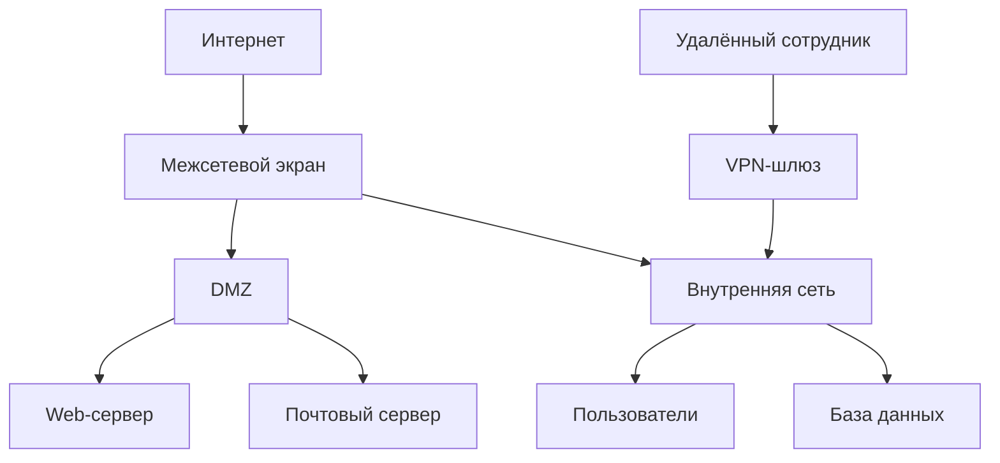

#term/concept #must-know #tech

# 🛡️ Основы сетевой безопасности

> [!abstract] Суть одной фразой
> Сетевая безопасность — это набор принципов, технологий и практик, направленных на защиту сети и передаваемых данных от несанкционированного доступа, перехвата и атак. Для специалиста по ИБ это фундамент, на котором строятся все защитные меры.

---

## 📌 Ключевые принципы

- **Защита периметра:** отделение внутренней сети от внешней с помощью [[Межсетевой экран (Firewall)|межсетевого экрана]]. Внешний трафик жёстко контролируется, внутренний — считается условно доверенным.
- **Сегментация сети:** разделение сети на изолированные сегменты (VLAN, подсети). Если злоумышленник попал в один сегмент, он не получает автоматического доступа ко всей сети.
- **Defence in Depth (глубокая эшелонированная защита):** многослойная оборона — файрвол, IDS/IPS, антивирус, шифрование, аудит. Взлом одного рубежа не даёт доступа ко всей системе.
- **Принцип наименьших привилегий (Least Privilege):** каждый пользователь или сервис получает только те права, которые ему действительно нужны.
- **Zero Trust:** концепция «не доверяй никому, даже внутри периметра». Каждый запрос на доступ проверяется, независимо от источника.

---

## 🧩 Компоненты сетевой безопасности

- **[[Межсетевой экран (Firewall)]]** — фильтрация трафика по IP, портам, протоколам.
- **IDS / IPS** — системы обнаружения и предотвращения вторжений, анализирующие трафик на предмет известных сигнатур атак.
- **[[VPN]]** — защищённый удалённый доступ и связывание офисов.
- **NAC (Network Access Control)** — контроль доступа к сети: проверка «здоровья» устройства перед подключением.
- **SIEM** — сбор и корреляция событий безопасности из разных источников.

---

## 🕵️ DMZ (Demilitarized Zone)

DMZ — это изолированный сегмент сети, куда выносят серверы, доступные из интернета (веб-сервер, почтовый сервер). Если злоумышленник взломает сервер в DMZ, он не получит доступа к внутренней сети.

---

## 🔗 Связи

- [[Межсетевой экран (Firewall)]], [[iptables]] — техническая реализация защиты периметра.
- [[VPN]], [[TLS]] — защита данных в движении.
- [[VLAN]] — сегментация на канальном уровне.
- [[Сетевые атаки (каталог)]] — от каких угроз защищаемся.

## 💬 Ответ на собеседовании (кратко)

> «Сетевая безопасность строится на принципах: защита периметра, сегментация, Defence in Depth, Least Privilege, Zero Trust. Основные компоненты: файрвол, IDS/IPS, VPN, SIEM. Для публичных сервисов используется DMZ».

## ❓ Самопроверка

1. **Что такое DMZ?** 👉 Изолированный сегмент для серверов, доступных из интернета.
2. **Чем отличается Defence in Depth от Zero Trust?** 👉 DiD — многослойная оборона, Zero Trust — проверка каждого доступа, даже внутри периметра.
3. **Зачем нужна сегментация сети?** 👉 Чтобы ограничить распространение атаки.