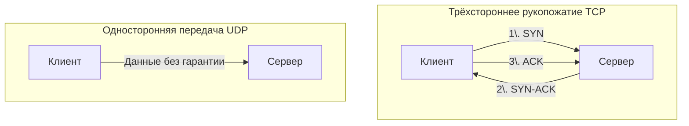

#term/concept #must-know #tech

# 🔄 Протоколы транспортного уровня: TCP и UDP

> [!abstract] Суть одной фразой
> TCP и UDP — это два главных протокола транспортного уровня (L4 по [[Модель OSI  (Open Systems Interconnection)|модели OSI]]), которые отвечают за доставку данных от приложения на одном хосте до приложения на другом. **TCP — надёжный, с гарантией доставки. UDP — быстрый, без гарантий.** Выбор между ними определяет, как приложение будет обмениваться данными через сеть.

Для специалиста по ИБ понимание разницы критично: ты должна знать, какой протокол использует целевой сервис, чтобы правильно анализировать трафик, настраивать [[iptables]] и выявлять аномалии.

---

## 📊 Таблица сравнения

| Характеристика | TCP | UDP |
|---|---|---|
| **Тип соединения** | С установкой соединения (connection-oriented) | Без соединения (connectionless) |
| **Гарантия доставки** | Да (подтверждения, повторные передачи) | Нет (отправил и забыл) |
| **Порядок пакетов** | Сохраняется (нумерация, пересборка) | Не гарантируется |
| **Скорость** | Медленнее (накладные расходы на handshake) | Быстрее (минимум накладных расходов) |
| **Заголовок** | 20–60 байт | 8 байт |
| **Контроль потока** | Да (скользящее окно) | Нет |
| **Типичные применения** | HTTP, HTTPS, SSH, FTP, SMTP | DNS, VoIP, стриминг, DHCP, онлайн-игры |

---

## 🔍 TCP — надёжный «курьер с подтверждением»

TCP (Transmission Control Protocol) работает как курьерская служба с уведомлением о вручении:

1. **Установка соединения (трёхстороннее рукопожатие):**
   - Клиент → сервер: `SYN` (хочу соединиться).
   - Сервер → клиент: `SYN-ACK` (я готов, давай).
   - Клиент → сервер: `ACK` (договорились).
2. **Передача данных:** каждый сегмент нумеруется, получатель подтверждает (`ACK`). Если подтверждение не пришло, отправитель повторяет передачу.
3. **Завершение соединения:** `FIN` → `ACK` → `FIN` → `ACK`.

**Ключевые флаги TCP:**
- `SYN` — запрос на установку соединения.
- `ACK` — подтверждение получения данных.
- `FIN` — запрос на завершение соединения.
- `RST` — аварийный разрыв соединения.

## ⚡ UDP — быстрый «почтовый голубь»

UDP (User Datagram Protocol) работает как обычная почта: отправил и забыл. Никаких подтверждений, никакой гарантии, что письмо дойдёт.

**Почему UDP всё ещё нужен:**
- **Скорость:** нет накладных расходов на handshake и подтверждения.
- **Простота:** заголовок всего 8 байт.
- **Незаменим для потоковых данных:** VoIP, видеозвонки, онлайн-игры — здесь потеря пары пакетов не критична, а задержка от повторных передач — критична.

---

## 🕵️ Значимость для ИБ

- **SYN-flood:** злоумышленник шлёт тысячи `SYN` и не завершает рукопожатие, истощая ресурсы сервера. Это классическая DoS-атака на TCP.
- **UDP amplification:** злоумышленник подделывает IP-адрес жертвы и шлёт UDP-запросы на открытые DNS/NTP-серверы, которые «отвечают» жертве большими пакетами, вызывая DDoS.
- **Сканирование портов:** TCP SYN-сканирование (nmap -sS) — самый популярный метод разведки.
- **Фильтрация:** `iptables` позволяет точечно блокировать TCP-пакеты с определёнными флагами или UDP-трафик на ненужные порты.

## 🔧 Инструменты

- **[[ss]]** — посмотреть, какие TCP/UDP порты открыты.
- **[[tcpdump]]** — захват TCP/UDP трафика.
- **nmap** — сканирование портов (SYN, UDP).
- **hping3** — ручная отправка TCP/UDP пакетов с заданными флагами.

## 🔗 Связи

- [[Модель OSI]] — TCP и UDP работают на транспортном уровне (L4).
- [[Протокол (сетевой)]] — общее понятие протокола.
- [[Порт (сетевой)]] — TCP и UDP используют порты для адресации приложений.
- [[iptables]] — фильтрация по протоколу (`-p tcp`, `-p udp`).

## 💬 Ответ на собеседовании (кратко)

> «TCP — надёжный протокол с установкой соединения и подтверждениями. UDP — быстрый, без гарантий. TCP используют HTTP, SSH, SMTP; UDP — DNS, DHCP, VoIP. С точки зрения безопасности TCP уязвим к SYN-flood, UDP — к amplification-атакам. Для аудита я использую `ss -tuln` и `tcpdump`».

## ❓ Самопроверка

1. **Как расшифровывается TCP?** 👉 Transmission Control Protocol.
2. **Сколько шагов в TCP handshake?** 👉 Три (SYN, SYN-ACK, ACK).
3. **Почему UDP быстрее TCP?** 👉 Нет handshake, подтверждений и повторных передач.