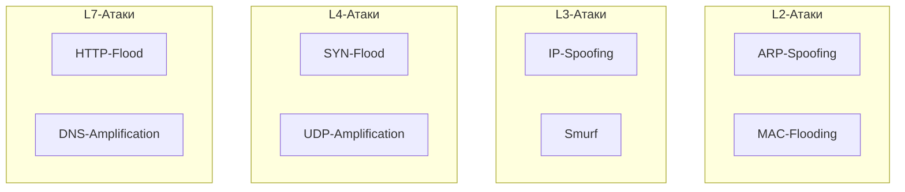

#term/concept #must-know #tech

# ⚔️ Сетевые атаки (каталог по уровням OSI)

> [!abstract] Суть одной фразой
> Сетевые атаки — это действия, направленные на нарушение [[Триада КЦД|конфиденциальности, целостности или доступности]] сетевого трафика и сервисов. Они классифицируются по уровням [[Модель OSI  (Open Systems Interconnection)|модели OSI]]: от физического отключения кабеля до эксплуатации уязвимостей веб-приложений.

Для специалиста по ИБ знание каталога атак — это способ быстро определить, на каком уровне работает злоумышленник, и какие меры защиты применить.

---

## 📌 Атаки по уровням OSI

| Уровень OSI | Атака | Суть |
|---|---|---|
| **L1 (Физический)** | Перерезание кабеля, глушение Wi-Fi | Физический обрыв связи |
| **L2 (Канальный)** | **MAC-flooding** | Переполнение таблицы MAC-адресов коммутатора, перевод его в режим хаба |
| | **ARP-spoofing** | Подмена MAC-адреса шлюза для перехвата трафика |
| | **VLAN hopping** | Обход изоляции VLAN через двойное тегирование или подделку DTP |
| **L3 (Сетевой)** | **IP-spoofing** | Подмена исходного IP-адреса |
| | **Smurf-атака** | ICMP-запросы на широковещательный адрес от имени жертвы |
| | **ICMP Redirect** | Перенаправление трафика жертвы через злоумышленника |
| **L4 (Транспортный)** | **SYN-flood** | Массовая отправка SYN-запросов без завершения рукопожатия TCP |
| | **UDP amplification** | Использование открытых DNS/NTP-серверов для усиления DDoS |
| | **TCP Session Hijacking** | Перехват активной TCP-сессии |
| **L7 (Прикладной)** | **HTTP-flood** | Множество легитимных HTTP-запросов для истощения ресурсов |
| | **DNS amplification** | Усиленная DDoS-атака через открытые DNS-резолверы |
| | **Slowloris** | Медленное исчерпание пула соединений веб-сервера |

---

## 🔍 Типовые цели атак

- **DDoS (Distributed Denial of Service):** сделать сервис недоступным, перегрузив его трафиком.
- **MITM (Man-in-the-Middle):** вклиниться в соединение и читать/изменять трафик.
- **Перехват учётных данных:** украсть логины/пароли из трафика (особенно HTTP, FTP).
- **Обход фильтрации:** проникнуть в сеть, обойдя файрвол или NAC.

---

## 🔗 Связи

- [[ARP]] — ARP-spoofing.
- [[DNS]] — DNS amplification, DNS-spoofing.
- [[TCP]], [[UDP]] — SYN-flood, UDP amplification.
- [[Межсетевой экран (Firewall)]] — защита от большинства атак.
- [[Модель OSI]] — классификация по уровням.

## 💬 Ответ на собеседовании (кратко)

> «Сетевые атаки классифицируются по уровням OSI. На L2 — ARP-spoofing, MAC-flooding. На L3 — IP-spoofing, Smurf. На L4 — SYN-flood, UDP amplification. На L7 — HTTP-flood, Slowloris, DNS amplification. Я понимаю, на каком уровне работает атака и какие средства защиты применить».

## ❓ Самопроверка

1. **На каком уровне OSI работает ARP-spoofing?** 👉 L2 (канальный).
2. **Что такое SYN-flood?** 👉 Массовая отправка SYN-запросов без завершения TCP-рукопожатия, истощает ресурсы сервера.
3. **Чем опасен DNS amplification?** 👉 Открытые DNS-серверы многократно усиливают трафик, направленный на жертву.